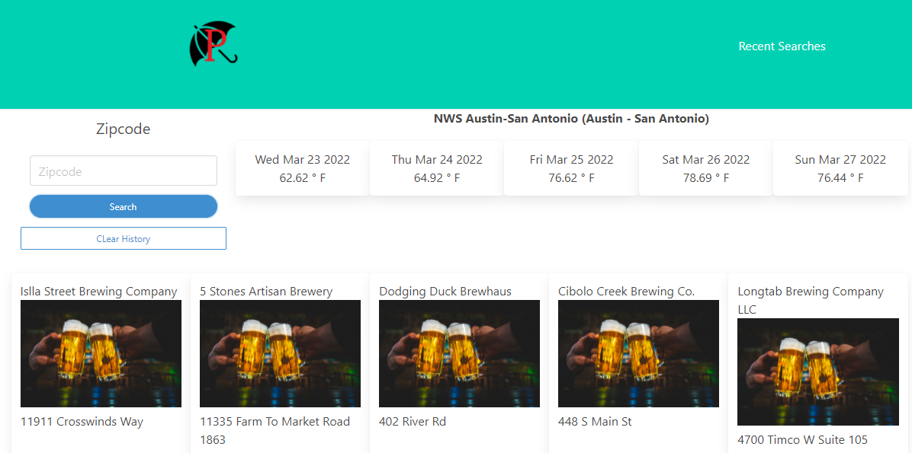

# Patio and Weather App

## Purpose

An application that will allow the user to search by zip for local breweries and also provides a 5 day forecast. After user has searched by zip, the zip is saved in local storage and added to the recent search modal. The user has the ability to clear recent searches by click the "Clear History" button.

## Built With

- HTML
- CSS
- JAVASCRIPT
- BULMA
- JQUERY

## Website

https://kyrotomato.github.io/Patio/

## Thumbnail

Made with ❤️💧🩸 by Jared Ruiz, Jonathan Franklin, & Thomas McCalister
